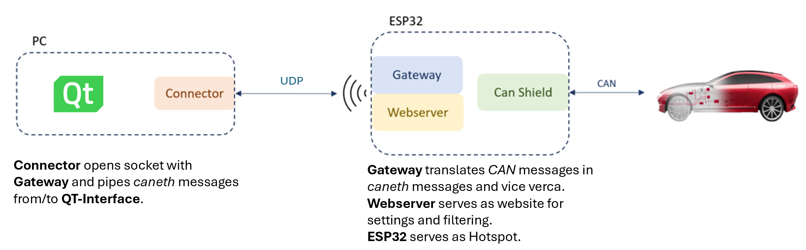
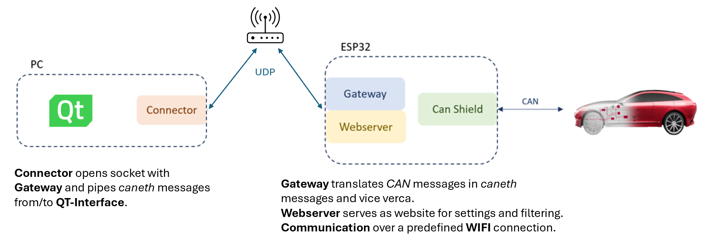
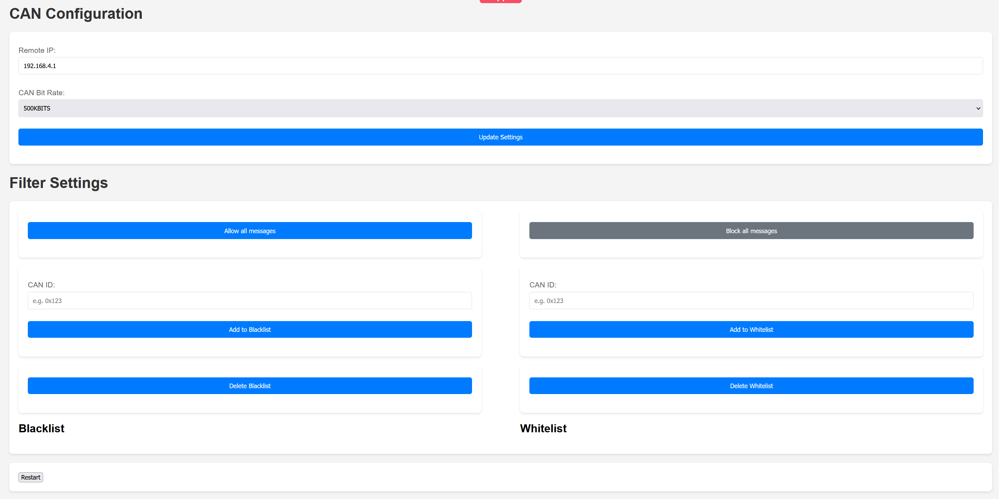
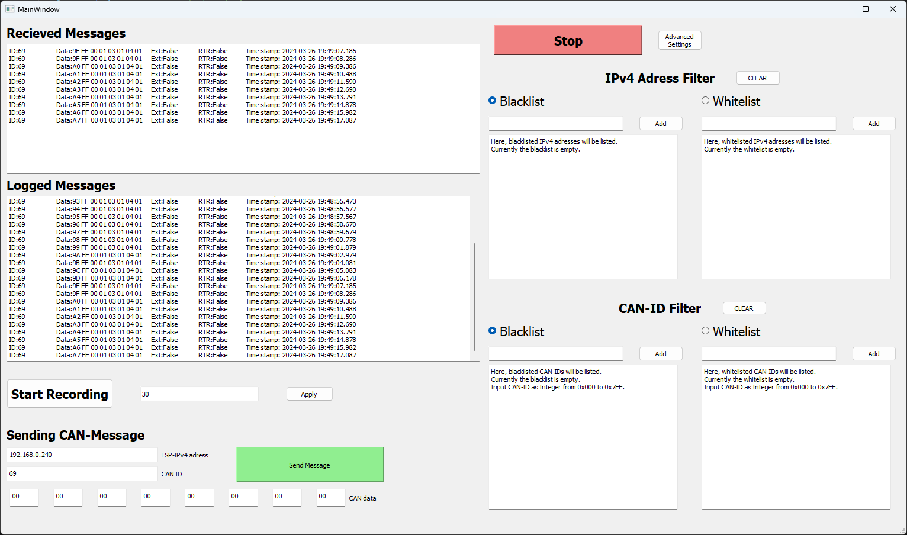
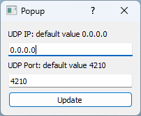

# ESP32-CAN-Shield

## Overview

This ESP32-CAN-Shield is a custom-designed shield for the ESP32-S3, primarily used as a CAN (Controller Area Network) to Wi-Fi bridge. It enables seamless integration and communication between CAN network systems and Wi-Fi networks, making it ideal for automotive and industrial applications where remote monitoring and control are necessary.




## Compatibility

**Note:** ESP32 development boards come in various widths. Ensure to adjust the header width of this shield to match your specific ESP32 board model.

## Hardware

The shield features a robust CAN transceiver schematic, including an optional termination resistor for network integrity.

### Key Components:

- **CAN Transceiver:** The [TCAN332DCNT](https://www.ti.com/lit/ds/symlink/tcan332.pdf?ts=1706343800000&ref_url=https%253A%252F%252Fwww.ti.com%252Fproduct%252FTCAN332%252Fpart-details%252FTCAN332D), a high-performance CAN transceiver from Texas Instruments.
- **Power Connection:** The shield connects directly to the ESP32 board via two header columns, supplying 3.3V power and ground.
- **Signal Pins:** Dedicated GPIOs for CAN high (CAN-H) and low (CAN-L) signals for RX and TX operations.
- **Termination Resistor:** A bridge connector enables an end-termination resistor, essential for reducing signal reflections on the CAN bus.
- **CAN Interface:** Utilizes a 2x5 IDC for CAN bus interfacing, with an IDC to D-SUB cable for standard D-SUB connections, compatible with devices like the Vector VN1610 and tools like CANoe.
- **Protection:** Incorporates a PESD2CAN diode in a small SOT23 SMD package, designed to protect the CAN lines from ESD and other transient damages. This ensures reliability and longevity in automotive environments.
- **Manufacturing Compatibility:** Designed in accordance with JLC Design Rules for easy custom manufacturing.

## Software

The software is structured into two components:

- The Gateway runs on the ESP and serves as the translater of CAN to caneth/caneth to CAN messages. It also serves a Website where different settings like CAN-speed and remote IP can be changed or a CAN-ID filter can be used.
- The connector which runs on a PC and sends/receives caneth Messages to the Gateway. It basically connects Busmaster or any other tool.

### Installation

#### Gateway

The Gateway is developed with PlatformIO it can be installed as VScode [extension](https://marketplace.visualstudio.com/items?itemName=platformio.platformio-ide). When the Gateway folder is opened in VScode, PlatformIO is automatically initalized and the project can be compiled and uploaded to the ESP. Make sure to add a `Gateway/include/Secrets.h` file with the desired WIFI configuration.

```
#ifndef SECRETS_H
#define SECRETS_H

//Put in the SSID and Password of the WIFI
#define WIFI_SSID "own-WIFI-SSID"
#define WIFI_PASSWORD "own-WIFI-Password"

//Define the SSID and Password for the hotspot of the ESP32
#define Hotspot_SSID "own-ESP32-SSID"
#define Hotspot_PASSWORD "own-ESP32-Password"

#endif
```

In the main.cpp of the gateway, the network setting can be modified via the mode variable.

- Mode = 1: The ESP32 connects to a predefined network.
- Mode = 2: The ESP32 acts as a Wi-Fi Access Point, which one still needs to connect to with a computer.

```
...
// WiFi and Hotspot settings
//Make sure you adjust the ssid and password in your Secrets.h to your WIFI
//mode = 1: connection with a predefined WIFI
//mode = 2: ESP32 as a WLAN-Access-Point
int mode = 1;
...
```
#### Webserver
On the Webserver there are several options to configure the communications and apply filter.

CAN Configuration:
- Remote IP: Enter the IP, where the messages should be send to. (Look up the IPv4-Adresse of your computer.)
- CAN Bit Rate: Adjust the Bit Rate according to your settings

Filter Option:
- Allow all Messages: All messages are forwarded. You can add CAN-IDs to to the Blacklist to block messages from certain CAN-Devices.
- Block all Messages: Blocks all messages. You can add CAN-IDs to to the Whitelist to forward messages from certain CAN-Devices.

Restart: Restarts the ESP32. It can take a moment to reconnet to the WIFI or you have to connect to the Hotspot from the ESP32 again.



#### Connector

The backend of the Connector application is a Python script with no external dependencies, besides the default Python 3.9 libraries. The programmed functions, classes, and their methods provide a comprehensive toolset to send, receive, and log CANeth messages. By default, the Connector is listening on all UDP IP channels for CANeth messages. Filters can be applied to restrict IPv4 addresses via a blacklist and whitelist. In addition to that, the CANeth messages can also be filtered by CAN ID via a blacklist and whitelist. The IPv4 address filter and the CAN ID filter are initially set to an empty blacklist, allowing all CANeth messages to be received. For ease of use, a graphical user interface (GUI) was implemented for the frontend of the Connector application using PyQt5. 



As depicted in the screenshot of the Connector application, the aforementioned features can be accessed through the GUI. In the popup of the advanced settings window, the UDP IP and the UDP port of the socket can be adjusted.



For independent usage of the Connector application outside of a Python interpreter, it was compiled with PyInstaller into a ConnectorApp.exe for Windows. The .exe file is designed to support 1080p and 2k screen resolutions.

#### Simulation

To simulate a device that sends/receives CAN-messages to the Bus either CANoe or a python script found in `Tools/canDevice.py` is used with a Vector VN1610. To use it follow this steps:

- install the `pip install python-can` package
- install the [latest drivers](https://www.vector.com/int/en/support-downloads/download-center/#product=%5B%2256540%22%5D&downloadType=%5B%22drivers%22%5D&tab=1&pageSize=30&sort=date&order=desc) for the Vector hardware Interface
- install the [XL Driver Library](https://www.vector.com/int/en/support-downloads/download-center/#product=%5B%22175%22%5D&downloadType=%5B%22drivers%22%5D&tab=1&pageSize=15&sort=date&order=desc) and copy the `vxlapi64.dll` into the working directory (If the driver doesn't show up, you have to manually add the vxlapi64.dll path to XL Driver Library)

### Usage

1. Attach CAN-Shield to ESP32 connect it to PC with the right USB-port and flash the Gateway-software. Before flashing, ensure you have included the [Secret.h](https://github.com/X1L3F/ESP32-CAN-Shield?tab=readme-ov-file#gateway) file in your project. Select your desired network mode in the `Gateway/main.cpp`.
2. Plug in IDC and connect to VN1610. Connect VN1610 to PC.
3. Access the web server using the IPv4-address of the ESP32. The method to retrieve this address depends on your network connection mode:
   - Hotspot on ESP32: Connect your computer to the ESP32's hotspot. Use the ipconfig command in your computer's command prompt to find the IPv4 address of the ESP32. Type this address into your web browser to access the web server.
   - Conncetion to predefined WIFI: The IPv4 address will be displayed in the Arduino IDE's Serial Monitor. Enter this IPv4 address into your web browser to navigate to the web server.
4. Configure the CAN Configurations on the [WebServer](https://github.com/X1L3F/ESP32-CAN-Shield?tab=readme-ov-file#webserver)
5. Start `Connector/qt_application_frontend.py` or the `dist/ConnectorApp.exe`, the UDP traffic can also be analyzed with Wireshark by filtering for `caneth`
6. Start CANoe or `Tools/canDevice.py`


## Additional resources for understanding CAN and programming CANeth
- [A Simple intro to CAN](https://www.csselectronics.com/pages/can-bus-simple-intro-tutorial)
- [ISO 11898](https://www.iso.org/standard/63648.html)
- [Two Wire Automotive Interface](https://docs.espressif.com/projects/esp-idf/en/latest/esp32s2/api-reference/peripherals/twai.html)
