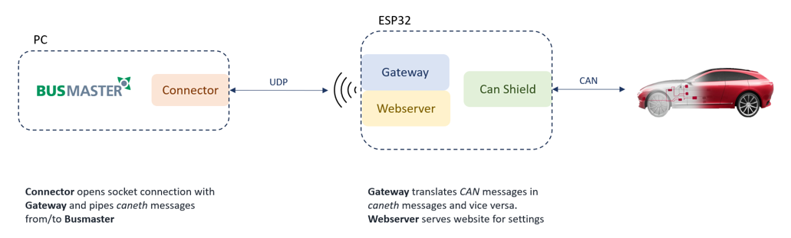

# ESP32-CAN-Shield

## Overview

This ESP32-CAN-Shield is a custom-designed shield for the ESP32-S3, primarily used as a CAN (Controller Area Network) to Wi-Fi bridge. It enables seamless integration and communication between CAN network systems and Wi-Fi networks, making it ideal for automotive and industrial applications where remote monitoring and control are necessary.



## Compatibility

**Note:** ESP32 development boards come in various widths. Ensure to adjust the header width of this shield to match your specific ESP32 board model.

## Hardware

The shield features a robust CAN transceiver schematic, including an optional termination resistor for network integrity.

### Key Components:

- **CAN Transceiver:** The [TCAN332DCNT](https://www.ti.com/lit/ds/symlink/tcan332.pdf?ts=1706343800000&ref_url=https%253A%252F%252Fwww.ti.com%252Fproduct%252FTCAN332%252Fpart-details%252FTCAN332D), a high-performance CAN transceiver from Texas Instruments.
- **Power Connection:** The shield connects directly to the ESP32 board via two header columns, supplying 3.3V power and ground.
- **Signal Pins:** Dedicated GPIOs for CAN high (CAN-H) and low (CAN-L) signals for RX and TX operations.
- **Termination Resistor:** A bridge connector enables an end-termination resistor, essential for reducing signal reflections on the CAN bus.
- **CAN Interface:** Utilizes a 2x5 IDC for CAN bus interfacing, with an IDC to D-SUB cable for standard D-SUB connections, compatible with devices like the Vector VN1610 and tools like CANoe.
- **Protection:** Incorporates a PESD2CAN diode in a small SOT23 SMD package, designed to protect the CAN lines from ESD and other transient damages. This ensures reliability and longevity in automotive environments.
- **Manufacturing Compatibility:** Designed in accordance with JLC Design Rules for easy custom manufacturing.

## Software

The software is structured into two components:

- The Gateway runs on the ESP and serves as the translater of CAN to caneth/caneth to CAN messages. It also serves a Website where different settings like CAN-speed and remote IP can be changed.
- The connector which runs on a PC and sends/receives caneth Messages to the Gateway. It basically connects Busmaster or any other tool.

### Installation

#### Gateway

The Gateway is developed with PlatformIO it can be installed as VScode [extension](https://marketplace.visualstudio.com/items?itemName=platformio.platformio-ide). When the Gateway folder is opened in VScode, PlatformIO is automatically initalized and the project can be compiled and uploaded to the ESP. Make sure to add a `Gateway/include/Secrets.h` file with the desired WIFI configuration.

```
#ifndef SECRETS_H
#define SECRETS_H

#define WIFI_SSID "ESP32_CAN_Shield"
#define WIFI_PASSWORD "choose-your-own-Password"

#endif
```

#### Connector

The Connector is a python script with no external dependencies.

#### Simulation

To simulate a device that sends/receives CAN-messages to the Bus either CANoe or a python script found in `Tools/canDevice.py` is used with a Vector VN1610. To use it follow this steps:

- install the `pip install python-can` package
- install the [latest drivers](https://www.vector.com/int/en/support-downloads/download-center/#product=%5B%2256540%22%5D&downloadType=%5B%22drivers%22%5D&tab=1&pageSize=30&sort=date&order=desc) for the Vector hardware Interface
- install the [XL Driver Library](https://www.vector.com/int/en/support-downloads/download-center/#product=%5B%22175%22%5D&downloadType=%5B%22drivers%22%5D&tab=1&pageSize=15&sort=date&order=desc) and copy the `vxlapi64.dll` into the working directory

### Usage

1. Attach CAN-Shield to ESP32 connect it to PC with the right USB-port and flash the Gateway-software
2. Plug in IDC and connect to VN1610. Connect VN1610 to PC.
3. Go to the settings website of the ESP by entering it's ip in a browser. And configure CAN-speed and IP of the Connector host.
4. Start `Connector/connector.py`, the UDP traffic can also be analyzed with Wireshark by filtering for `caneth`
5. Start CANoe or `Tools/canDevice.py`
